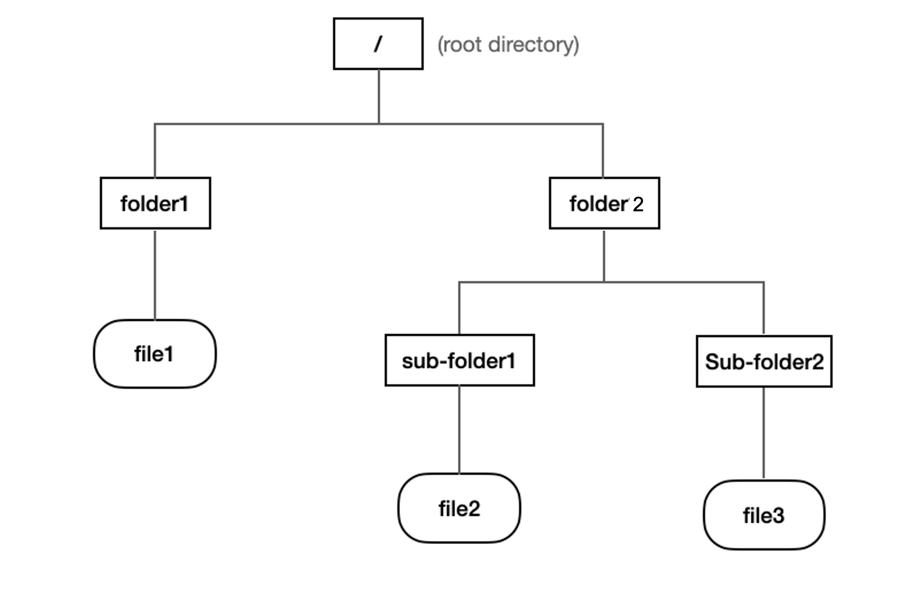

# Demo Video
https://drive.google.com/drive/u/1/folders/1cfa_85c8P9Aj9NVcWMU_j5lu84LTYLwX

# Requirement

1. Clone the base repository 

2. Implement a user application and system calls as described below, ensuring that all of the design requirements are met

3. Provide clear documentation using Doxygen

4. Submit your code to GitHub and issue a link via Canvas

5. Prepare a demo video showing your final prototype

# **Description of User Application**

## Design Plan

File system is the way in which files are named and where they are placed logically for storage and retrieval, deletion and modification. They are wildly used in modern computer system and can differ differ between operating systems (OS), such as Microsoft Windows, Unix and Linux-based systems. Some file systems are designed for specific applications. Major types of file systems include distributed file systems, disk-based file systems and special purpose file systems.

The micro kernel that can support system calls interface, multithreading and parallel computing. Based on this accomplishment, our team believe it’s an opportunity for us to enhance our skills, and focus more in upper level logistic implementing the Unix-Like tree structure file system module. Our file system currently support text file (in `char` format) and is implemented on device (Heap, RAM). User can interact with this file system via RTT console, supported features includes `create`, `write`, `read`, `copy`, `delete`. 

### File System

Similar to Unix File System, our team adopt the concept of N-Ary child tree structure to build up the file system. Every tree node are represent as a directory, which can be a file or a folder. Several directories construct as a path. The root node on top will serve as `root` directory, denoted as `/` . File system related code are added in src/inc folder respectively, naming as `file_system.c`, `file_system.h`

For example, In the below file system diagram, we have following  folders and files existed 

- `/` : root directory
- `/folder1` : folder type
- `/folder2`: folder type
- `/folder1/sub-folder1` : folder type
- `/folder2/sub-folder2`: folder type
- `/folder1/sub-folder1/file1` :file type
- `/folder1/sub-folder1/file2` : file type
- `/folder2/sub-folder2/file3`: file type


### Back of Envelope Calculation

Back of envelope calculations is a technique used within software engineering to determine how a system should be designed. In the previous section we already layout the overall architecture of the tree structure. Here we will evaluate few important parameters in our system.

Our File System existed in Heap memory section, directory as `file` will have char buffer to store text data. Each node have several `dir_node` as children. Since our current system allocated 8k as heap memory, deduct miscellaneous usage, we have around `7k` for the entire system. If we can support up to `N = 5` and maximum depth of tree as 2 (not including root). In this case, we can have up to 5**2 = 25 files, and 31 (1 + 5 + 25) of dir_node struct. All the struct node will contains up to roughly 100 bytes of memory, so for data_buffer, each can stores up to 7 * 1024 / 25 = **285** bytes. (up to 285 words)

Finally, the tree structure can be referred to as follows:

```c
typedef struct dir_node dir_t;
struct dir_node {
    dir_t* children[5];
    dir_t* dir[50];
    bool is_file;
    char data_buffer[285]; // can support up to 285 bytes
};
```

# Task BreakDown

## Task 0: User Interface and Protocols

As stated before, user can interact with the file system by sending commands through RTT. The commands and related parameters are specified below. 

### Create Command

In console, three arguments are required. First is `create`, means it’s a create command. Second is path, third one specify if it’s a folder or file (1 = file / 0 = folder)

```
Create File:
- create /path/file1 1

Create folder:
- create /path/file1 0
```

### Write Command

In console, three arguments are required. First is `write`, means it’s a write command. Second is path, third one specify the content.

```
Write File:
- write /path/file1 "hello, world"
```

### Read Command

In console, three arguments are required. First is `read`, means it’s a read command. Second is path.

```
Read File:
- read /path/file1
```

### Copy Command

In console, three arguments are required. First is `copy`, means it’s a copy command. Second is the original path, while third on is the copy-to path.

```
Copy File:
- copy /path1/file1 /path2/file2
```

### Delete Command

In console, two arguments are required. First is `delete`, means it’s a delete command. Second is path.

```
Delete Folder:
- delete /path/folder

Delete File:
- delete /path/file
```

## Task 1: Custom System Calls

Five system calls are supported in here, which are `create`, `write`, `read`, `copy` , `delete`. 

```c
boolean create_directory(string path, boolean is_file);
```

Originally our file system only have the root directory. If user want to create a directory (can be a folder or a file), he/she can call `create_direcotry` , path depth is limited to 2 now as we specify in previous section. 

```c
boolean write_file(string path, char* content);
```

Once user have created files, he/she can write content into that file buffer. Here in our file system the write will overwrite anything that is already in the files. 

```c
boolean read_file(string path);
```

Once user have created files, he/she can read content from that file buffer. Here in our file system we currently only support text format payload. 

```c
boolean copy_file(string path);
```

Once user have create files, he/she can copy file and put in other path. Once a file is copied and created, all the children path will be copied and created as well. 

```c
boolean delete_file(string path);
```

Once user have created files, he/she can delete file. Once a file is deleted all the children path will be deleted as well. 

## Task 2: Create Command Implementation

### User Command

```
/**
* Create a file path to store the data. 
*
* @param  file-path
* @param  is_file
* @return 1 if create successfully, otherwise -1
*/
create <file-path>
```

### Implementation Guide

By passing the file path, users can use create command to create a corresponding tree data structure to read/write data later. Paths are represented by strings. In this project, a path string will take the form `/directory/directory2/.../file-name`. Moreover, paths are always taken to be relative to the root of the file system.

## Task 3: Write Command Implementation

### User Command

```
/**
* Write data in the existing file path. 
*
* @param  file-path
* @param  file-content
* @return 1 if create successfully, otherwise -1 (the file path does not exist)
*/	
write <file-path> <file-content>
```

### Implementation Guide

Users can execute this command to write data on the created path (if the path does not exist, the file system should return an error). Thread 0 listens to the console command and creates a corresponding thread for each write command. This implementation should use the multi-threading function.
In addition, to ensure data consistency, we will use the mutex implemented to provide well-behaved clients with data consistency across multiple requests. Each file and directory may be locked for shared reading or exclusive writing. Multiple clients may lock the same object (file or directory) for reading at the same time, but when a client locks an object for exclusive access, no other client can lock the same object for any kind of access.
To avoid the different write requests influencing each other, in this project, we design the write request on a first-come, first-serve basis. It must never be the case that a request for a lock later is granted access before a request earlier.

## Task 4: Read Command Implementation

### User Command

```
/**
* Read the data from the existing file path. 
*
* @param  file-path
* @return 1 if read successfully, otherwise -1
*/	
read <file-path>
```

### Implementation Guide

Users can execute this command to read data in the created path. It should be noted that if the path is read before data is written, the system needs to return an error.
Similar to the write command, thread 0 will create a corresponding thread for each read command. The Multi-threading function allows our file system to process many commands in parallel. On the other hand, the biggest difference from the write command is that our system supports shared reading. Different read requests can read the same path at the same time.

## Task 5: Copy Command Implementation

### User Command

```
/**
* Copy data between two different file path. 
*
* @param  src-file-path the path which has source data
* @param  dst-file-path copy data to this path 
* @return 1 if copy successfully, otherwise -1
*/	
copy <src-file-path> <dst-file-path>
```

### Implementation Guide

Users can execute this command to copy data from the source file path to the destination file path. Thread 0 listens to the console command and creates a corresponding thread for this copy command.
This instruction will cause an error as follows:

1. The source file path has not been created
2. The source file path has not been written into any data
3. The destination file path has not been created

## Task 6: Delete Command Implementation

- User Command
    
    ```
    /**
    * Delete data from the existing file path. 
    *
    * @param  file-path
    * @return 1 if delete successfully, otherwise -1
    */	
    delete <file-path>
    ```
    
- Implementation Guide
    
    Users can execute this command to delete the file path. Thread 0 listens to the console command and creates a corresponding thread for this delete command.
    In practice, we will delete the corresponding tree data structure. If users want to use this file path later, they should execute the create command of Task 2 to recreate the file path.
    

## Task 7: Test

We implement unit test (more focus on single command and interaction), and integration test (combination of several commands with multithreading, intervention). To choose different test configuration, we implement maro `TEST_ENABLE` in file_system source file.

### Unit Test (Interaction)

Five unit testcases are designed in order to guarantee our File System functionalities. Since they are unit tests only focus on single functionality, we can integrate them with RTT commands and verify the user interaction at the same time. 

**Create Unit Testcase (test on creating folder)**

Step-by-Step:

1. User enter command in RTT console: 

```
create /folder/folder
```

1. Assign an folder, and check related property
2. Print “Test Passed” in the end

**Create Unit Testcase (test on file)**

Step-by-Step:

1. User enter command in RTT console: 

```
create /folder/file1
```

1. Assign an empty file, and check related property
2. Print “Test Passed” in the end

**Write Unit Testcase**

Pre-Condition: 

- Create command test passed
- System already exist one file in `/folder/file`

Step-by-Step:

1. User enter command in RTT console: 

```
write /folder/file "Hello, world"
```

1. Write the file, and check related property
2. Print “Test Passed” in the end

**Read Unit Testcase**

Pre-Condition: 

- Create command test passed
- Write command test passed
- System already exist one file in `/folder/file`
- File has already written: `Hello, world!`

Step-by-Step:

1. User enter command in RTT console: 

```
read /folder/file
```

1. Read from the file, and check related property
2. Print “Test Passed” in the end

**Copy Unit Testcase**

Pre-Condition: 

- Copy command test passed
- System already exist one file in `/folder1/file1`

Step-by-Step:

1. User enter command in RTT console: 

```
copy /folder1/file1 /folder2/file2
```

1. Copy the file from the `/folder1/file1` to `/folder2/file2`, and check related property
2. Print “Test Passed” in the end

**Delete Unit Testcase**

Pre-Condition: 

- Delete command test passed
- System already exist one file in `/folder1/file`

Step-by-Step:

1. User enter command in RTT console: 

```
delete /folder/file
```

1. Delete the file from the `/folder/file`, and check related property
2. Print “Test Passed” in the end

### Integration Test

The Integration test will involve multi threads and cover all features that supported by our file system. This test will not involved RTT interface, since in the integration test we will implement test script that create several threads, each have different priorities, duration and task to perform. 

Basically the original file system have 10 files, 5 in depth1, and the other 5 in depth 2. Eventually those file will first be copied to a different path, then modified to other contents. 

```

/* Original File System*/
/root
|_ fold1
  |_file1: "H"
  |_file2: "E"
  |_file3: "L"
  |_file4: "L"
  |_file5: "O"

/* After Test File System*/
/root
|_ fold1
  |_file1: "H"
  |_file2: "E"
  |_file3: "L"
  |_file4: "L"
  |_file5: "O"
|_ folder3
  |_file1: "H"
  |_file2: "E"
  |_file3: "L"
  |_file4: "L"
  |_file5: "O"
```

Pre-Condition: 

- Create, Read, Write, Delete, Copy command test passed
- System already setup as mentioned above

Step-by-Step:

1. Run test script and check related property
2. Print log as followed

```
Create Success!
Create Success!
Create Success!
Create Success!
Create Success!
Create Success!
Write Success!
Write Success!
Write Success!
Write Success!
Write Success!
Data: H
Data: E
Data: L
Data: L
Data: O
Create Success!
Copy Success!
Copy Success!
Copy Success!
Copy Success!
Copy Success!
Data: H
Data: E
Data: L
Data: L
Data: O
Delete Success!
Data:
Data:
Data:
Data:
Data:
```
